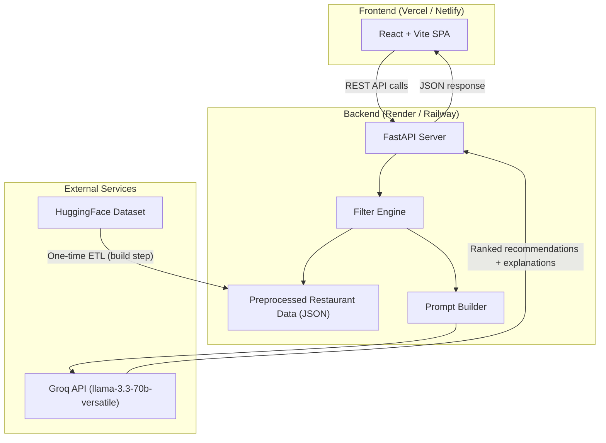
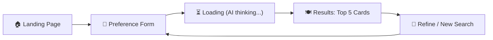
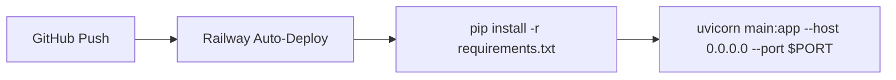
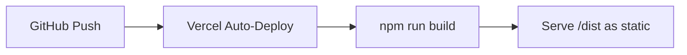

# 🏗️ Architecture: AI-Powered Restaurant Recommendation Web App

> **Scope**: Bangalore restaurants only · **LLM**: Groq (llama-3.3-70b-versatile) · **Type**: Full-stack web application · **Deployment**: Frontend (Vercel) & Backend (Railway)

---

## Table of Contents

1. [High-Level Architecture](#1-high-level-architecture)
2. [Dataset & Data Pipeline](#2-dataset--data-pipeline)
3. [Backend (API Server)](#3-backend-api-server)
4. [Frontend (Web App)](#4-frontend-web-app)
5. [LLM Integration (Groq)](#5-llm-integration-groq)
6. [Deployment Strategy](#6-deployment-strategy)
7. [Claude Design Prompt](#7-claude-design-prompt)
8. [Project Directory Structure](#8-project-directory-structure)
9. [Tech Stack Summary](#9-tech-stack-summary)

---

## 1. High-Level Architecture



### Flow Summary

1. **One-time ETL**: Download Zomato dataset from HuggingFace → clean & filter to Bangalore → export as optimized JSON
2. **User submits preferences** via the frontend form
3. **Backend filters** the dataset based on location, cuisine, budget, rating
4. **Prompt is built** with filtered restaurant data + user preferences
5. **Groq API** returns ranked recommendations with explanations
6. **Frontend renders** beautiful recommendation cards

---

## 2. Dataset & Data Pipeline

### 2.1 Source

| Property | Value |
|---|---|
| **Dataset** | [ManikaSaini/zomato-restaurant-recommendation](https://huggingface.co/datasets/ManikaSaini/zomato-restaurant-recommendation) |
| **Format** | Parquet (via HuggingFace `datasets` library) |
| **Size** | 10K–100K rows |
| **Scope** | Filtered to **Bangalore only** |

### 2.2 Raw Schema (from HuggingFace)

| Column | Type | Description |
|---|---|---|
| `url` | Text | Zomato URL of the restaurant |
| `address` | Text | Full address |
| `name` | Text | Restaurant name |
| `online_order` | Text | Yes/No — supports online ordering |
| `book_table` | Text | Yes/No — supports table booking |
| `rate` | Text | Rating (e.g., "4.1/5", "NEW", "-") |
| `votes` | Int64 | Number of votes |
| `phone` | Text | Contact number(s) |
| `location` | Text | Neighbourhood (e.g., Indiranagar, Whitefield, Koramangala) |
| `rest_type` | Text | Type (e.g., Casual Dining, Quick Bites, Café) |
| `dish_liked` | Text | Popular dishes (comma-separated) |
| `cuisines` | Text | Cuisines served (comma-separated) |
| `approx_cost(for two people)` | Text | Approximate cost for two (e.g., "800", "1,200") |
| `reviews_list` | Text | Stringified list of reviews |
| `menu_item` | Text | Menu items |
| `listed_in(type)` | Text | Listing type (Buffet, Delivery, Dine-out, etc.) |
| `listed_in(city)` | Text | City/area listing |

### 2.3 ETL Pipeline (`scripts/prepare_data.py`)

This is a **one-time build step** run before deploying the backend.

```
HuggingFace Dataset
       │
       ▼
┌─────────────────────────────────┐
│  1. Load with `datasets` lib    │
│  2. Filter: listed_in(city)     │
│     contains Bangalore areas    │
│  3. Clean `rate` → float        │
│  4. Clean `approx_cost` → int   │
│  5. Drop: reviews_list,         │
│     menu_item, url, phone       │
│  6. Deduplicate by name+address │
│  7. Normalize location names    │
│  8. Export → restaurants.json    │
└─────────────────────────────────┘
```

### 2.4 Cleaned Schema (what the backend uses)

| Field | Type | Example |
|---|---|---|
| `id` | int | 1 |
| `name` | string | "Toit" |
| `address` | string | "298, 100 Feet Road, Indiranagar" |
| `location` | string | "Indiranagar" |
| `cuisines` | list[str] | ["Continental", "American", "Italian"] |
| `cost_for_two` | int | 1600 |
| `rating` | float | 4.5 |
| `votes` | int | 15234 |
| `rest_type` | string | "Casual Dining" |
| `online_order` | bool | true |
| `book_table` | bool | true |
| `dish_liked` | list[str] | ["Craft Beer", "Nachos", "Burger"] |
| `listed_in_type` | string | "Dine-out" |

### 2.5 Bangalore Locations (expected in `location` column)

> The dataset is Bangalore-specific. The `location` column contains neighbourhoods:

Indiranagar, Koramangala, Whitefield, Jayanagar, JP Nagar, HSR Layout, BTM Layout, Marathahalli, Bannerghatta Road, Electronic City, MG Road, Brigade Road, Malleshwaram, Rajajinagar, Basavanagudi, Yelahanka, Hebbal, Bellandur, Sarjapur Road, Kalyan Nagar, Frazer Town, Church Street, Lavelle Road, Commercial Street, Residency Road, Cunningham Road, Sadashivanagar, RT Nagar, Banaswadi, Kammanahalli, etc.

---

## 3. Backend (API Server)

### 3.1 Technology

| Component | Choice | Rationale |
|---|---|---|
| **Framework** | FastAPI (Python) | Async, fast, auto-docs via OpenAPI |
| **LLM Client** | `groq` Python SDK | Official SDK, simple API |
| **Data Store** | In-memory JSON (loaded at startup) | Dataset is small enough (~5–15 MB) |
| **CORS** | FastAPI `CORSMiddleware` | Allow frontend origin |
| **Deploy** | Railway | Easy Python deploys, persistent services |

### 3.2 API Endpoints

#### `GET /api/health`
Health check.

#### `GET /api/locations`
Returns list of unique Bangalore locations from the dataset.

```json
{
  "locations": ["Indiranagar", "Koramangala", "Whitefield", ...]
}
```

#### `GET /api/cuisines`
Returns list of unique cuisines.

```json
{
  "cuisines": ["North Indian", "Chinese", "Italian", ...]
}
```

#### `POST /api/recommend`
Main recommendation endpoint.

**Request Body:**
```json
{
  "location": "Indiranagar",
  "cuisines": ["Italian", "Continental"],
  "budget": "medium",
  "min_rating": 3.5,
  "dining_type": "Dine-out",
  "preferences": "family-friendly, good ambiance"
}
```

**Budget Mapping:**
| Budget | Cost for Two (₹) |
|---|---|
| Low | 0 – 500 |
| Medium | 500 – 1500 |
| High | 1500+ |

**Response:**
```json
{
  "recommendations": [
    {
      "name": "Toit",
      "location": "Indiranagar",
      "cuisines": ["Continental", "American"],
      "rating": 4.5,
      "cost_for_two": 1600,
      "rest_type": "Casual Dining",
      "online_order": true,
      "book_table": true,
      "dish_liked": ["Craft Beer", "Burger"],
      "ai_explanation": "Toit is a top pick for you because..."
    }
  ],
  "summary": "Based on your preferences for Italian food in Indiranagar..."
}
```

### 3.3 Backend Architecture (Internal)

```
backend/
├── main.py                  # FastAPI app, CORS, startup
├── routers/
│   └── recommend.py         # /api/recommend, /api/locations, /api/cuisines
├── services/
│   ├── data_service.py      # Load & filter restaurant data
│   ├── llm_service.py       # Groq API integration
│   └── prompt_builder.py    # Build LLM prompt from data + preferences
├── models/
│   └── schemas.py           # Pydantic models (request/response)
├── data/
│   └── restaurants.json     # Preprocessed Bangalore restaurant data
├── scripts/
│   └── prepare_data.py      # ETL: HuggingFace → cleaned JSON
├── requirements.txt
├── .env.example             # GROQ_API_KEY=
└── README.md
```

### 3.4 Filter Logic (`data_service.py`)

```
User Input → Filter Pipeline:

1. Location Match     → exact match on `location` field
2. Cuisine Match      → any overlap between user cuisines and restaurant cuisines
3. Budget Filter      → cost_for_two within budget range
4. Rating Filter      → rating >= min_rating
5. Dining Type        → listed_in_type matches if provided
6. Keyword Score      → match preferences vs dish_liked, rest_type, name
7. Sort by            → pref_score DESC, rating DESC, votes DESC
8. Limit              → Top 15 candidates → send to LLM
```

### 3.5 Prompt Engineering (`prompt_builder.py`)

The prompt sent to Groq will follow this structure:

```
SYSTEM: You are a restaurant recommendation expert for Bangalore, India.
Given a list of restaurants and user preferences, rank the top 5 restaurants
and explain why each is a good fit. Be specific, mention dishes, ambiance,
and value for money. Return valid JSON.

USER:
## User Preferences
- Location: {location}
- Cuisines: {cuisines}
- Budget: {budget} (₹{min_cost} – ₹{max_cost} for two)
- Minimum Rating: {min_rating}
- Additional: {preferences}

## Available Restaurants (pre-filtered)
{formatted_restaurant_list}

## Instructions
Rank the top 5 restaurants. For each, provide:
1. Restaurant name
2. Why it's recommended (2-3 sentences, specific to user preferences)
3. A confidence score (1-10)
Return as JSON array.
```

---

## 4. Frontend (Web App)

### 4.1 Technology

| Component | Choice | Rationale |
|---|---|---|
| **Framework** | React + Vite | Fast dev, optimized builds |
| **Styling** | Vanilla CSS (custom design system) | Full control, premium aesthetics |
| **HTTP Client** | `fetch` API | No extra deps |
| **Deployment** | Vercel | Free, instant deploys, CDN |
| **Design Tool** | Claude Design | High-fidelity UI generation |

### 4.2 Pages & Components

```
frontend/
├── index.html
├── src/
│   ├── main.jsx
│   ├── App.jsx
│   ├── index.css                 # Design system & global styles
│   ├── pages/
│   │   ├── HomePage.jsx          # Hero + preference form
│   │   └── ResultsPage.jsx       # Recommendation cards + summary
│   ├── components/
│   │   ├── Header.jsx            # Logo, nav
│   │   ├── PreferenceForm.jsx    # Location, cuisine, budget selectors
│   │   ├── RestaurantCard.jsx    # Individual recommendation card
│   │   ├── AISummary.jsx         # AI-generated overview block
│   │   ├── FilterChips.jsx       # Active filter pills
│   │   ├── LoadingState.jsx      # Skeleton/animation while LLM processes
│   │   └── Footer.jsx
│   └── utils/
│       └── api.js                # API client functions
├── public/
│   └── favicon.svg
├── package.json
├── vite.config.js
└── .env.example                  # VITE_API_URL=
```

### 4.3 User Flow



1. **Landing Page**: Hero section with tagline, CTA button
2. **Preference Form**: Multi-select dropdowns (location, cuisine), budget slider, rating selector, free-text preferences
3. **Loading State**: Animated skeleton cards + "AI is curating your perfect restaurants..." message
4. **Results**: 5 restaurant cards with AI explanation, plus an overall summary card
5. **Refine**: Modify filters and re-search

### 4.4 Design Principles

- **Dark mode first** with warm accent colors (amber/orange tones evoking food & warmth)
- **Glassmorphism** cards with subtle backdrop-blur
- **Micro-animations**: card reveal (stagger), hover lift effects, gradient shifts
- **Typography**: Inter/Outfit from Google Fonts
- **Mobile responsive**: form stacks vertically, cards go single-column

---

## 5. LLM Integration (Groq)

### 5.1 Configuration

| Parameter | Value |
|---|---|
| **Provider** | Groq Cloud |
| **Model** | `llama-3.3-70b-versatile` |
| **SDK** | `groq` (Python) |
| **Auth** | `GROQ_API_KEY` environment variable |
| **Temperature** | 0.7 (creative but grounded) |
| **Max Tokens** | 2048 |
| **Response Format** | JSON mode |

### 5.2 Usage Pattern (`llm_service.py`)

```python
from groq import Groq
import os, json

client = Groq(api_key=os.environ.get("GROQ_API_KEY"))

def get_recommendations(prompt: str) -> dict:
    response = client.chat.completions.create(
        model="llama-3.3-70b-versatile",
        messages=[
            {"role": "system", "content": SYSTEM_PROMPT},
            {"role": "user", "content": prompt}
        ],
        temperature=0.7,
        max_tokens=2048,
        response_format={"type": "json_object"}
    )
    return json.loads(response.choices[0].message.content)
```

### 5.3 Rate Limits & Error Handling

- **Groq free tier**: ~30 RPM, 14,400 RPD
- Implement retry with exponential backoff (3 attempts)
- Graceful fallback: if LLM fails, return top-filtered results without AI explanation
- Cache identical queries for 5 minutes (in-memory `dict`)

---

## 6. Deployment Strategy

### 6.1 Overview

| Component | Platform | URL Pattern |
|---|---|---|
| **Backend** | Railway | `https://restro-api.up.railway.app` |
| **Frontend** | Vercel | `https://restro-recs.vercel.app` |

### 6.2 Backend Deployment (Railway)



**Environment Variables:**
- `GROQ_API_KEY` — Groq API key
- `ALLOWED_ORIGINS` — Frontend URL for CORS

### 6.3 Frontend Deployment (Vercel)



**Environment Variables:**
- `VITE_API_URL` — Backend URL (e.g., `https://restro-api.onrender.com`)

### 6.4 Development Workflow

| Phase | Command | Port |
|---|---|---|
| Backend dev | `uvicorn main:app --reload` | 8000 |
| Frontend dev | `npm run dev` | 5173 |
| Data prep | `python scripts/prepare_data.py` | N/A |

---

## 7. Claude Design Prompt

> **Use this prompt in Claude Design to generate the frontend UI.** Copy-paste it along with the project context files.

---

### 📋 Prompt for Claude Design

```
CONTEXT:
I'm building an AI-powered restaurant recommendation web app for Bangalore, India.
Users fill a preference form (location, cuisine, budget, rating, free-text) and
the app returns the top 5 AI-curated restaurant recommendations with explanations.

TECH STACK:
- React + Vite (JSX, no TypeScript)
- Vanilla CSS (no Tailwind)
- Google Fonts: Inter for body, Outfit for headings

DESIGN REQUIREMENTS:

1. THEME & COLORS:
   - Dark mode primary (deep charcoal #0f0f0f background)
   - Warm accent gradient: amber (#F59E0B) → orange (#F97316) → red (#EF4444)
   - Glass cards: rgba(255,255,255,0.05) with backdrop-blur(16px)
   - Subtle borders: rgba(255,255,255,0.08)
   - Text: white (#FAFAFA) primary, gray (#9CA3AF) secondary

2. LANDING / HOME PAGE:
   - Full-viewport hero with a subtle animated gradient background
   - Large heading: "Discover Bangalore's Best Restaurants"
   - Subheading: "AI-powered recommendations tailored to your taste"
   - CTA button with gradient + hover glow animation
   - Minimal nav header with logo on left

3. PREFERENCE FORM (main interaction):
   - Floating glass card centered on page
   - Fields:
     a) Location — searchable dropdown with Bangalore areas:
        Indiranagar, Koramangala, Whitefield, Jayanagar, JP Nagar, HSR Layout,
        BTM Layout, Marathahalli, Bannerghatta Road, Electronic City, MG Road,
        Brigade Road, Malleshwaram, Rajajinagar, Basavanagudi, etc.
     b) Cuisines — multi-select chips/tags:
        North Indian, Chinese, Italian, Continental, South Indian, Street Food,
        Cafe, Biryani, Desserts, Mexican, Thai, Japanese, etc.
     c) Budget — segmented control (Low ≤₹500 | Medium ₹500–₹1500 | High ₹1500+)
     d) Minimum Rating — star rating selector (1–5, half-star steps)
     e) Dining Type — toggle pills (Dine-out, Delivery, Buffet, Cafes)
     f) Additional Preferences — text input ("family-friendly, rooftop, live music...")
   - "Find My Restaurant ✨" submit button with gradient + micro-animation

4. LOADING STATE:
   - Show 5 skeleton card placeholders with shimmer animation
   - Animated text: "AI is curating your perfect dining experience..."
   - Subtle pulsing food emoji or icon

5. RESULTS PAGE:
   - AI Summary card at top (glass card with sparkle icon ✨):
     "Based on your love for Italian food in Indiranagar with a medium budget..."
   - 5 Restaurant recommendation cards in a staggered grid (2 columns on desktop, 1 on mobile)
   - Each card shows:
     • Restaurant name (large, bold)
     • Location badge (pill)
     • Cuisine tags (colored chips)
     • Rating with star icon + vote count
     • Cost for two with ₹ symbol
     • Restaurant type badge
     • Online order / Book table availability icons
     • Popular dishes (small tags)
     • AI Explanation paragraph (highlighted with a subtle left border accent)
   - Cards animate in with staggered fade-up on load
   - Hover: subtle lift + shadow increase
   - "Search Again" floating button

6. RESPONSIVE:
   - Desktop: 2-column card grid, form centered max-width 600px
   - Tablet: 2-column grid
   - Mobile: single column, full-width cards, stacked form

7. MICRO-ANIMATIONS:
   - Button hover: gradient shift + subtle glow
   - Card entrance: staggered translateY + opacity
   - Form field focus: border color transition to accent
   - Page transitions: fade
   - Rating stars: fill animation on hover

8. OVERALL FEEL:
   - Premium, modern, Zomato-meets-AI aesthetic
   - Think: Linear.app + Zomato dark mode crossover
   - NOT minimal/boring — rich, engaging, "wow" factor

OUTPUT:
Generate the complete React + Vite application with:
- index.html
- src/main.jsx, App.jsx, index.css
- All page and component files as described
- Use vanilla CSS with CSS custom properties for the design system
- All components should be functional React components
- Use fetch() for API calls to VITE_API_URL
- Include mock data so the UI works standalone for preview
```

---

### 📎 Files to Attach in Claude Design

When using Claude Design, paste/attach these for full context:

1. **This file** (`architecture.md`) — full architecture context
2. **`problemstatement.md`** — project requirements
3. **Sample `restaurants.json`** (once generated) — so Claude can use realistic mock data

---

## 8. Project Directory Structure

```
Restro recommendations/
├── Docs/
│   ├── problemstatement.txt
│   ├── problemstatement.md
│   ├── architecture.md              ← YOU ARE HERE
│   ├── implementation_plan.md
│   ├── edgecase.md
│   └── evals.md
│
├── backend/
│   ├── main.py
│   ├── routers/
│   │   └── recommend.py
│   ├── services/
│   │   ├── data_service.py
│   │   ├── llm_service.py
│   │   └── prompt_builder.py
│   ├── models/
│   │   └── schemas.py
│   ├── data/
│   │   └── restaurants.json
│   ├── scripts/
│   │   └── prepare_data.py
│   ├── requirements.txt
│   ├── .env.example
│   └── README.md
│
├── frontend/
│   ├── index.html
│   ├── src/
│   │   ├── main.jsx
│   │   ├── App.jsx
│   │   ├── index.css
│   │   ├── pages/
│   │   │   ├── HomePage.jsx
│   │   │   └── ResultsPage.jsx
│   │   ├── components/
│   │   │   ├── Header.jsx
│   │   │   ├── PreferenceForm.jsx
│   │   │   ├── RestaurantCard.jsx
│   │   │   ├── AISummary.jsx
│   │   │   ├── FilterChips.jsx
│   │   │   ├── LoadingState.jsx
│   │   │   └── Footer.jsx
│   │   └── utils/
│   │       └── api.js
│   ├── public/
│   │   └── favicon.svg
│   ├── package.json
│   ├── vite.config.js
│   ├── .env.example
│   └── README.md
│
└── README.md                        # Root project overview
```

---

## 9. Tech Stack Summary

| Layer | Technology | Version |
|---|---|---|
| **LLM** | Groq Cloud — llama-3.3-70b-versatile | Latest |
| **Backend** | Python, FastAPI, Uvicorn | Python 3.11+ |
| **LLM SDK** | `groq` Python package | Latest |
| **Data Processing** | pandas, `datasets` (HuggingFace) | Latest |
| **Frontend** | React, Vite | React 18+, Vite 5+ |
| **Styling** | Vanilla CSS | — |
| **Frontend Deploy** | Vercel | — |
| **Backend Deploy** | Railway | — |
| **Design** | Claude Design | — |

---

> [!IMPORTANT]
> **Phase Order**: 
> 1. Run `scripts/prepare_data.py` to generate `restaurants.json` (data pipeline)
> 2. Build & deploy **backend** first (API must be live before frontend can call it)
> 3. Build frontend with Claude Design using the [prompt above](#7-claude-design-prompt)
> 4. Deploy frontend, pointing `VITE_API_URL` to the live backend
